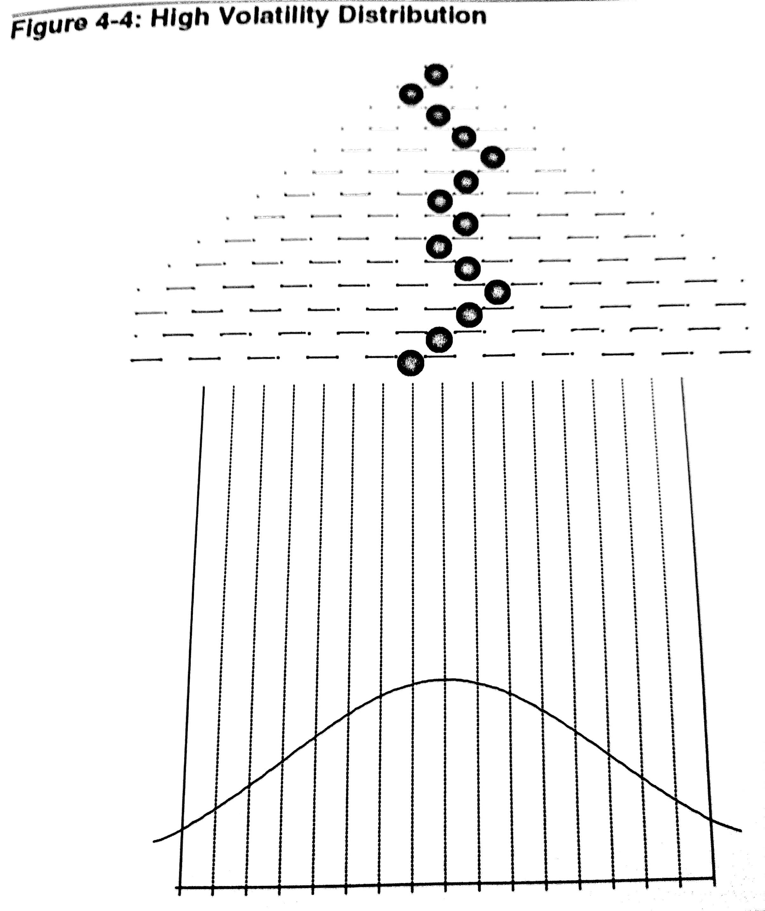

## Factors that impact Options Pricing:

Option pricing is obviously affected by the direction in which the underlying moves. An additional factor that an options trader must take into account in the speed with which the underlying moves in the desired direction.

The most popular theoretical model used for determining value of options is called the *Black-Scholes* Method. Actually, that's not all: there are other input parameters that affect the theoretical value of options.

-   **Exercise Price**: This is a constant/unchangeable throughout the life of an option. It's one of the invariants that defines the option.
-   **Time to Expiration**: The expiration date on the option is constant therefore the time remaining to expiration keeps ticking and this is one of most significant factors impacting the value of an option. We will cover Greeks at a later point and see how one of the greeks allow us to understand how this parameter affects the pricing of an option (THETA)
-   **Underlying Price**: This is the parameter that, perhaps, most intuitively affects the pricing of an option. As the price of the underlying changes the option also changes, this corresponding change in the pricing of option for every unit change in underlying price is described by a Greek named DELTA. We will look later at how DELTA can be used understanding the effect of underlying price on option pricing.
-   **Interest Rates**: An option may result in cash debit or credit. In due time, we will visit the 'credit' part of things in detail.
-   Dividends: Underlying that provide dividends to the stock holders does impact the option pricing through the year. However, these special/specific events to a company and they are not factored into the options pricing model as a separate factor, however, they are factored into the pricing via another parameter volatility.
-   **Volatility**: This is perhaps the most significant, yet, by far the most difficult parameter to understand for traders. In trading, changes to volatility can depend on various situations and assumptions. This can impact the price of the options significantly. We will visit this in detail in the next section.

### Volatility: What is volatility and why is it so important to a trader?

-   An options trader, like a trader in the underlying instrument, is interested in the direction of the market. But if a trader in equity is wrong about the direction of the instrument, capital permitting, it is possible to wait out for the underlying to turn in your favor (Ex: Buy and Hold investment)
-   An options trader does not have this luxury, since he has to be right about the speed in which the instrument moves in the originally estimated direction, the long options will expire worthless as we have seen earlier.
-   In some sense, to understand volatility, we can think of them as a measure of the speed of the market. Typically, slow markets tend to have low volatility and fast changing markets tend to have higher volatility.
-   During high volatility, the markets tend to not only price the options differently but also they tend to **behave** differently from other times.
-   This is an absolutely critical concept to understand and internalize if you want to succeed as an options trader. To understand this concept better, we will touch upon some basics of Volatility and Distribution. This will help us converge to understanding how these concept correlate.

{:.foo}

-   The figure shows a pinball maze, when a ball is dropped into the maze at the top it moves downward, through a series of pegs/nails.
-   When the ball encounters each nail there is a 50% chance the ball will move to the right, and a 50% chance it will move left. Theball then falls down to a new level where it encounters another nail. Finally, at the bottom of the maze the ball falls into one of the troughs.
-   The path the ball follows as it moves downward through the maze of nails is known as a *randomwalk*. Once the ball enters the maze nothing can be done to aritificially alter its course, nor can one predict ahead of time the path the ball will take through the maze.
-   If enough balls are dropped into this maze we begin to get a distribution of balls similar to that in Figure 
{:.foo}
-   Most balls tend to congregate near the center of the maze with a decreasing number of balls ending up in troughs further away from the center. The distribution which results from dropping many balls into our maze is referred  to as a *normal* or *bell-shaped* distribution.
-   If we were to drop an infinite number of balls into the maze we get something that looks like a classic *bell curve*, such *Normal Distribution* curves are used to describe the likely outcomes of random events.
-   Suppose we change our maze slightly by closing off a row of nails so that each time a ball encounters a nail and goes either left or right, it must drop down two levels before it encounters another nail. If we drop enough balls into the maze we may end up with a distribution represented by the curve in  {:.foo}

Since the sideways movement of the ball is restricted, the curve will have a higher peak and narrower tails than the curve in normal distribution. This is representative of a *Low Volatility Distribution*
Conversely, if the vertical movement of the ball is restricted by making the pins/pegs horizontal, then the ball would more likely move laterally than vertically dropping straight to a slot closer to the center. In this case, the overall distribution is wider therefore having lower peaks and wider ranges. This represents a *High Volatility Distribution* {:.foo}

As it can be seen in the {:.foo} a Strike can be closer to ITM DELTAs (In The Money) or far OTM (Out The Money) depending on how the volatility. This will have an impact the pricing of the options accordingly.
