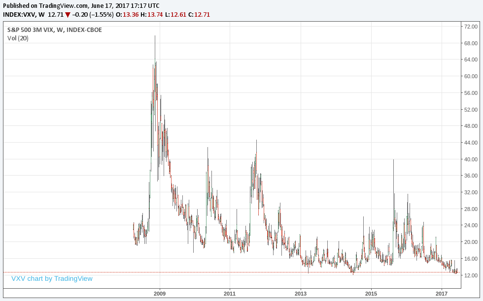

# What is Implied Volatility (IV)?

In simple words, Implied Volatity is derived from the current price of the options on an underlying. It is represented in terms of percentage, this percentage indicates the annual expected range within which the stock can move. For example, let's assume the 

    IV of AAPL which is, say, trading at 150 is 20%.

# What does 1 Standard Deviation mean?

To understand this we will revisit some of the [distributions article](http://www.commonmansoptions.com/distributions/). In a normal distribution curve, +/-1 standard deviation is a measurement that encompasses approximately 68.2% (or about 2/3) of the outcomes. +/-2 standard deviations represent approximately 95.4% (or about 19/20) of all occurences. +/-3 standard deviations represent about 99.7% (or about 369/370) of all occurences. In the earlier example of AAPL, 

    IV of 20% with AAPL trading at 150 indicates a
    1-standard deviation range of $30 over the next year.
    Therefore, based on current pricing AAPL could move anywhere
    between 120-180 in the coming year with a probability of 68.2%.

# Why should I care about IV?

According to famous trader Tom Sosnoff (paraphrased):

    Options are basically insurance contracts and when
    the future of the assets becomes uncertain, there
    is more demand for insurance on that asset. When applied
    to stocks, this means that a stock's options will
    become more expensive as market participants become
    more uncertain about the stock's performance in the future.

Just like in the world health/life insurance, the more uncertain the future is the more premium you'd have to pay for securing insurance. When this uncertainty in the underlying increases then the options are traded at higher prices, IV will increase. This is referred to as \*"IV expansion"\*. On the other side, there is \*"IV contraction"\*. This occurs when the fear and uncertainty related to a stock diminishes. As this happens, the stock's options decrease in price which results in a decrease in IV.

Therefore, IV gives us a standard way to evaluate prices of options from one underlying to another without having to look at the value of the options itself.

    VXV at 69.24 on Nov 20 2008
    VXV at 11.38 on Feb 20 2007
    VXV at 12.41 on Jun 16 2017

Look at the chart below:

<!-- TradingView Widget BEGIN -->

<!-- TradingView Widget END -->

{:.foo}